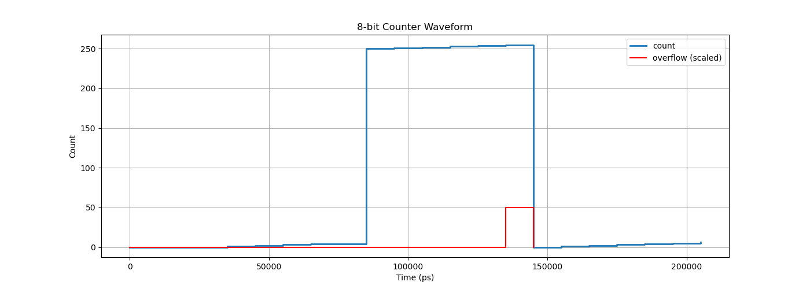

# 🔢 8-bit Synchronous Counter with Load & Overflow Detection

> A synthesizable 8-bit counter written in Verilog with asynchronous active-low reset, enable, synchronous load, and overflow detection — simulated with Icarus Verilog and synthesized to a gate-level netlist using Yosys.


---

## 📖 Overview

The **8-bit Synchronous Counter** is a fully synthesizable RTL design that counts from 0 to 255 on the rising edge of a clock. It includes four control signals — asynchronous active-low reset, enable, synchronous load, and overflow detection — making it a practical building block for real digital systems such as program counters, baud rate generators, FIFO pointers, and hardware timers.

The design is verified through a self-checking testbench, synthesized to a gate-level netlist with Yosys, and includes both GTKWave and Python/matplotlib waveform views.

---

## ✨ Features

- 🔁 **8-bit count register** — counts from 0 to 255 synchronously on every rising clock edge
- ⚡ **Asynchronous active-low reset** — immediately forces count to 0 regardless of clock
- ⏸️ **Enable control** — hold `EN` low to pause counting; resume without losing state
- 📥 **Synchronous load** — instantly jump to any 8-bit value on the next clock edge
- 🚩 **Overflow flag** — pulses high for exactly one clock cycle when count wraps from 255 → 0
- ✅ **Self-checking testbench** — automatically validates all control paths and reports pass/fail
- 📊 **Dual waveform views** — inspect signals in GTKWave or plot them with Python/matplotlib

---

## 🛠️ Tools Used

| Tool | Purpose |
|------|---------|
| **Icarus Verilog** | RTL simulation and testbench execution |
| **Yosys** | Synthesis from RTL to gate-level netlist |
| **GTKWave** | VCD waveform inspection and debugging |
| **Python + matplotlib** | Waveform plotting from VCD data |

---

## 🔌 Port Description

| Port | Direction | Width | Description |
|------|-----------|-------|-------------|
| `clk` | Input | 1-bit | Clock — rising edge triggered |
| `rst_n` | Input | 1-bit | Active-low asynchronous reset |
| `en` | Input | 1-bit | Count enable |
| `load` | Input | 1-bit | Synchronous load enable |
| `data_in` | Input | 8-bit | Value to load when `load` is high |
| `count` | Output | 8-bit | Current counter value |
| `overflow` | Output | 1-bit | Pulses high for one cycle on 255 → 0 wrap |

---

## 📈 Waveform

**Simulation Output:**



The waveform validates all control paths in sequence:

| Time | Event |
|------|-------|
| `0 – 20 ns` | Reset held low → count stays at `0x00` |
| `20 ns` | Enable asserted → count begins: `0 → 1 → 2 → 3 → 4` |
| Load event | Synchronous load to `0xFA` (250) |
| Post-load | Counting resumes: `250 → 251 → 252 → 253 → 254 → 255` |
| Overflow | `overflow` pulses high for one cycle as count wraps `255 → 0` |
| Post-wrap | Continues normally: `0 → 1 → 2 → 3 → 4 → 5 → 6` |

---

## 🚀 Quick Start

### Prerequisites

```bash
# Ubuntu / Debian
sudo apt install iverilog gtkwave yosys python3-matplotlib
```

### Simulate

```bash
make sim       # Compile and run testbench, generate waves.vcd
make wave      # Open waveform in GTKWave
```

### Synthesize

```bash
make synth     # Produce gate-level netlist via Yosys
```

### Plot Waveforms with Python

```bash
python3 plot_waves.py   # Plot waveform from VCD using matplotlib
```

---

## ⚙️ Makefile Targets

| Command | Action |
|---------|--------|
| `make sim` | Compile and run the simulation, generate VCD |
| `make wave` | Open waveform in GTKWave |
| `make synth` | Synthesize RTL to gate-level netlist with Yosys |
| `make clean` | Remove all generated files |

---

## 📊 Synthesis Results (Yosys)

Synthesized targeting the `synth` generic cell library:

| Metric | Value |
|--------|-------|
| **Flip-Flops** (DFFE) | 8 — one per bit of `count` |
| **Combinational Gates** | 29 |
| **Total Cells** | 37 |
| **Gate Types** | AND, OR, XOR, MUX, DFFE |

The synthesis confirms minimal logic overhead — the enable and load multiplexers resolve to MUX cells, and the overflow flag maps to a single AND gate across all 8 bits of the count register.

---

## 💻 How It Works

```
Rising clock edge
        ↓
   rst_n == 0?
    ↙       ↘
  YES         NO
   ↓           ↓
count = 0   load == 1?
             ↙       ↘
           YES         NO
            ↓           ↓
      count = data_in  en == 1?
                        ↙     ↘
                      YES      NO
                       ↓        ↓
                  count++    hold
                       ↓
               count == 0 after wrap?
                       ↓
               overflow pulses HIGH (1 cycle)
```

---

## 📁 Project Structure

```
8-bit-Synchronous-Counter/
├── rtl/
│   └── counter_8bit.v              # RTL design (synthesizable Verilog)
├── sim/
│   └── tb_counter_8bit.v           # Self-checking testbench
├── sim_output/
│   └── waves.png                   # Waveform screenshot
├── plot_waves.py                   # Python waveform plotter (VCD → matplotlib)
├── Makefile                        # Build automation
├── .gitignore                      # Excludes *.vvp, *.vcd, generated files
└── README.md
```

---

## 🧠 What I Learned

- Designing RTL with both sequential (flip-flop) and combinational logic in a single `always` block
- Writing a self-checking testbench that automatically validates counter behaviour across all control paths
- Running a full synthesis flow from Verilog RTL through Yosys to a gate-level netlist and interpreting cell usage
- Understanding how counters serve as fundamental building blocks in real systems:

| Application | Counter Role |
|-------------|-------------|
| CPU | Program counter — tracks the next instruction address |
| UART | Baud rate generator — divides clock to match serial timing |
| FIFO | Read/write pointers — manage buffer head and tail positions |
| Timers | Tick counters — generate interrupts and measure elapsed time |

---

## 🔮 Future Improvements

- Extend to a configurable N-bit counter using a Verilog `parameter`
- Add a down-count mode with an `up_down` control pin
- Implement a terminal count output that holds when the counter reaches a configurable max value
- Write a UVM-based testbench for structured functional verification
- Target a real FPGA (Xilinx / Intel) and report post-place-and-route timing and LUT usage

---

## 👤 Author

**Deep Chatterjee**  
[GitHub](https://github.com/deep-chatterjee)

---

## 📄 License

This project is licensed under the MIT License — see [LICENSE](LICENSE) for details.
